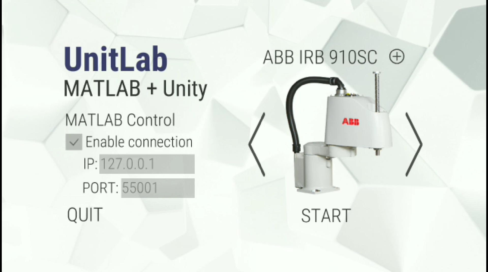
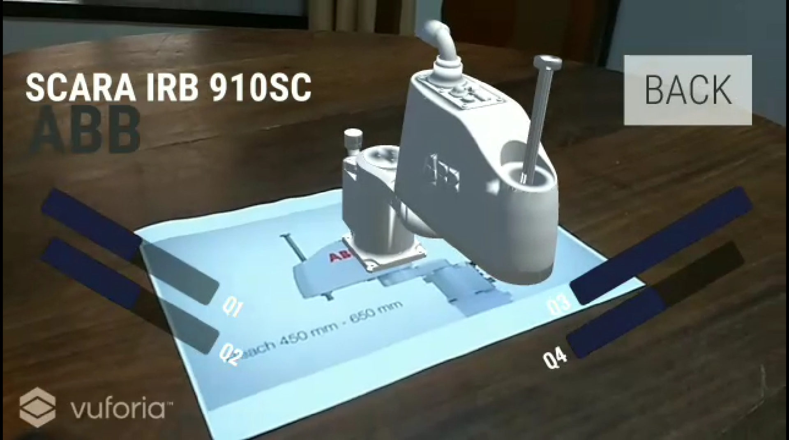
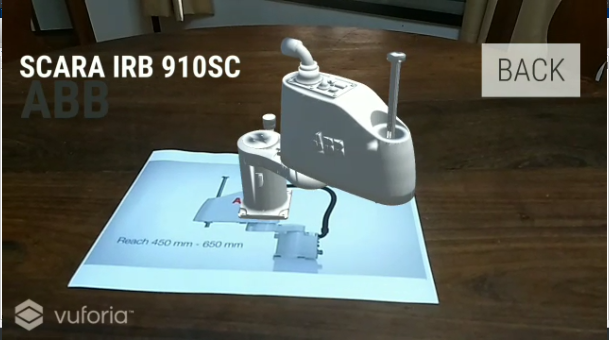

# Realidad Aumentada en Herramientas de Robótica

El proyecto consiste en una aplicación educativa de realidad aumentada para dispositivos móviles con sistema operativo Android, que se comunica mediante protocolo TCP/IP con un programa desarrollado por el usuario en su computador con MATLAB, utilizando el toolbox *Robotics, Vision & Control* desarrollado por Peter Corke. El objetivo de la aplicación es la simulación, es un entorno de realidad aumentada, de los robots manipuladores serie estudiados en las cátedras vinculadas a la robótica.

## Modo de uso de la Aplicación Móvil para Establecer la Comunicación con MATLAB
El modo en que el usuario debe usar la aplicación móvil para efectuar exitosamente la simulación con datos de su programa en MATLAB es el siguiente:

1. Crear el programa en MATLAB, basado en un manipulador tipo *UnityLink*, con por ejemplo un bucle que calcula las diferentes configuraciones articulares deseadas y luego las envía mediante el método *UnityLink.SnedQ*.
2. Abrir la aplicación móvil desarrollada en Unity.
3. En la pantalla principal de la aplicación, introducir la dirección IP del dispositivo móvil, y el puerto en el que se desea establecer la comunicación.
4. Al objeto *UnityLink* creado en el programa en MATLAB, cambiarle sus atributos *ip* y *port* por los mismos introducidos en la aplicación (Es importante que la IP sea de la misma red que la computadora).
5. Habilitar la conexión con MATLAB en la aplicación móvil con la opción *EnableConnection*.
6. Proceder a la escena con la cámara de Vuforia presionando en la aplicación el botón *Start*.
7. Apuntar al target impreso, donde aparecerá el modelo 3D del robot en realidad aumentada.
8. Ejecutar el programa en MATLAB para que envíe la secuencia de configuraciones articulares. El robot en la aplicación móvil debería moverse si la conexión fue exitosa.

Modo manual               |  Conexión con MATLAB via TCP/IP
:-------------------------:|:-------------------------:
  |  

## Trabajo a Futuro
Dadas las limitaciones del tiempo del trabajo quedan aspectos que se desearía continuar desarrollando. Algunos de estos aspectos son:

- Incorporación de otros modelos de robot comerciales de distintos fabricantes que se utilicen en el programa de Robótica I y Robótica II, para que el estudiante pueda apreciar sus dimensiones reales, y su desempeño en un espacio de trabajo similar al real.
- Mejorar la interfaz para los comandos manuales al robot desde la aplicación.
- Mejorar el aspecto visual de la aplicación, incorporar la posibilidad de utilizar el dispositivo móvil en posición vertical.
- Limpiar el código y crear prefabs de Unity que permitan que el proyecto sea más escalable.
- Ampliar la comunicación con MATLAB a otras herramientas de robótica distintas, por ejemplo, el uso de ROS (Robot Operating System) con el software de simulación Gazebo. Esto se vio imposibilitado dado la poca experiencia con la herramienta.
- Trabajar sobre el protocolo de comunicación, sobre el protocolo TCP/IP utilizado. Analizar y estudiar con mayor profundidad los diferentes aspectos de la comunicación implementada. - Corregir errores, y plantear la posibilidad de hacer broadcast para la comunicación con múltiples dispositivos móviles o la posibilidad de una interfaz de comunicación distinta.
- Trabajar con distintos marcadores para los aspectos de realidad aumentada.
- Plantear la posibilidad de simular trabajos cooperativos entre múltiples robot en un entorno de realidad aumentada.
- Continuar con el desarrollo de la clase UnityLink para facilitarle al usuario el desarrollo de su aplicación en MATLAB.
